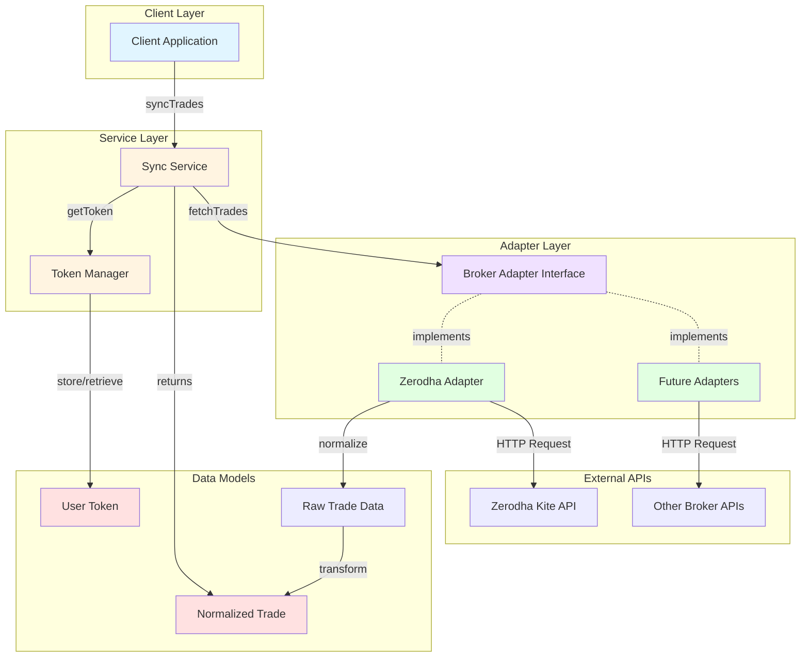
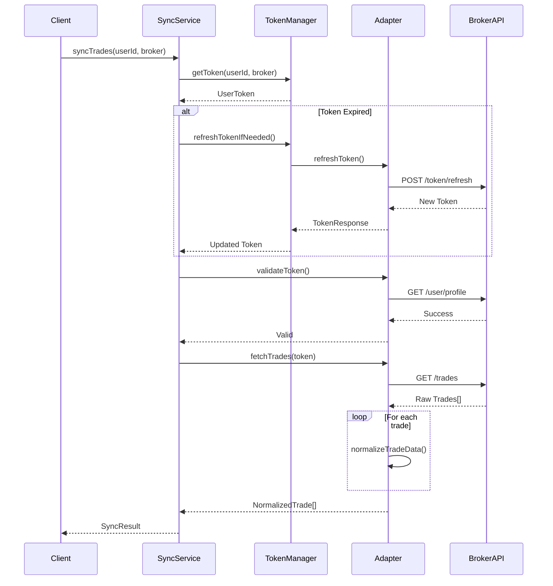
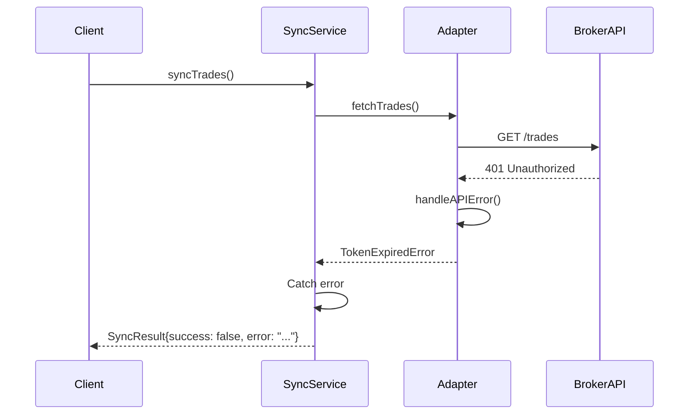

# System Architecture

## Overview

The Broker Integration Layer follows a modular, adapter-based architecture that separates concerns and allows easy extension for new brokers.

## Architecture Diagram



## Component Responsibilities

### 1. Client Application
- Initiates trade sync requests
- Manages user authentication flow
- Stores user credentials
- Processes normalized trade data

### 2. Sync Service
**Responsibilities:**
- Orchestrates the entire sync workflow
- Manages broker adapter selection
- Coordinates token validation and refresh
- Handles error scenarios
- Returns normalized results

**Key Methods:**
- `syncTrades(userId, brokerName, options)` - Main sync function
- `syncMultipleBrokers(userId, brokerNames, options)` - Multi-broker sync
- `registerAdapter(adapter)` - Add new broker support
- `getAvailableBrokers()` - List supported brokers

### 3. Token Manager
**Responsibilities:**
- Store user authentication tokens
- Check token expiry
- Trigger token refresh when needed
- Manage token lifecycle

**Key Methods:**
- `storeToken(userId, token)` - Save token
- `getToken(userId, brokerName)` - Retrieve token
- `isTokenExpired(token)` - Check expiry
- `refreshTokenIfNeeded(userId, brokerName, adapter)` - Auto-refresh

### 4. Broker Adapter Interface
**Responsibilities:**
- Define contract for all broker adapters
- Ensure consistent API across brokers
- Enable polymorphic broker handling

**Required Methods:**
- `fetchTrades(accessToken, options)` - Get trades from broker
- `normalizeTradeData(rawTrade)` - Transform to standard format
- `refreshToken(refreshToken)` - Get new access token
- `validateToken(accessToken)` - Check token validity

### 5. Zerodha Adapter
**Responsibilities:**
- Implement Kite Connect API integration
- Handle Zerodha-specific authentication
- Transform Zerodha trade format
- Manage API errors and rate limits

**Features:**
- HTTP client with interceptors
- Error mapping to custom error types
- Timestamp parsing
- Product type mapping

## Data Flow

### Successful Sync Flow



### Error Handling Flow



## Extensibility

### Adding a New Broker

1. **Create Adapter Class**
   ```typescript
   export class NewBrokerAdapter implements IBrokerAdapter {
     readonly brokerName = 'newbroker';
     // Implement required methods
   }
   ```

2. **Register in SyncService**
   ```typescript
   const adapter = new NewBrokerAdapter(apiKey);
   syncService.registerAdapter(adapter);
   ```

3. **Use Immediately**
   ```typescript
   await syncService.syncTrades(userId, 'newbroker');
   ```

### Design Patterns Used

1. **Adapter Pattern** - Broker adapters
2. **Singleton Pattern** - Service instances
3. **Factory Pattern** - Adapter registration
4. **Strategy Pattern** - Pluggable broker implementations

## Security Considerations

1. **Token Storage**: Currently in-memory; production should use encrypted storage
2. **API Keys**: Stored in environment variables, never in code
3. **HTTPS**: All broker API calls use HTTPS
4. **Token Expiry**: Automatic detection and refresh
5. **Error Messages**: Sanitized to avoid leaking sensitive data

## Performance Considerations

1. **Async Operations**: All I/O operations are asynchronous
2. **Parallel Sync**: `syncMultipleBrokers` runs in parallel
3. **Caching**: Token validation results could be cached
4. **Rate Limiting**: Should be added for production use

## Future Enhancements

1. **Persistent Storage**: Database integration for tokens and trades
2. **Webhook Support**: Real-time trade notifications
3. **Batch Processing**: Bulk trade sync for multiple users
4. **Retry Logic**: Exponential backoff for failed requests
5. **Metrics**: Performance monitoring and analytics
6. **Rate Limiting**: Built-in rate limiter
7. **Historical Data**: Support for date range queries (where available)
